# CPD Practical Work - Performance Evaluation of Single-Core and Multi-Core Matrix Multiplication Algorithm Implementations

<center>

**Joaquim Cunha** - up202108779@up.pt  
**José Sousa** - up202006141@up.pt  
**Miguel Garrido** - up202108889@up.pt  

</center>


## Introduction

The goal of this project was to implement matrix multiplication algorithms, compare them, document them and analysing the performance results of the code for each implementation - 3 single-core and 2 multi-core. This allowed us to study the toll the access/usage of large amounts of data in memory took on the CPU's performance.

We decided to compare the different algorithms' performance in C++ and Rust.

## Problem Description

The problem consisted in analysing the performance of matrix multiplication algorithms - particularly the effect on processor performance in the memory hierarchy when accessing large amounts of data (and not necessarily the algorithm's result itself).

Three different algorithms were used in this project - the goal being to evaluate their respective performances in a single-core implementation. These algorithms were developed in both C++ and Rust; we gathered data from multiple attempts with different square matrix sizes. 

Since we were required to utilize C++, we decided to use Rust as the secondary programming language - its similarities to C++, alongside its superior memory safety and concurrency features, made it a rather interesting choice from our point of view.

## Algorithms Explanation

### Simple Matrix Multiplication

A simple matrix multiplication algorithm implementation was provided to us in C++ - we later decided to implement the second version of it in Rust.
The algorithm itself consists in obtaining the result in the *i-th* row and *j-th* column of matrix C via the product of the elements in the *i-th* row of matrix A and the *j-th* column of matrix B.

If we consider a square matrix with *n* lines and columns, the time complexity of this algorithm should be O(n<sup>3</sup>).

```cpp
for(i = 0; i < m_ar; i++) {
    for(j = 0; j < m_br; j++) {
        temp = 0;
	    for(k = 0; k < m_ar; k++) {
		    temp += pha[i*m_ar+k] * phb[k*m_br+j];
	    }
	    phc[i*m_ar+j]=temp;
	}
}
```

### Line Matrix Multiplication

This algorithm, having been implemented in both C++ and Rust, uses the one mentioned earlier as a basis, although with a key difference: the order of the second and third `for` loops is switched. This results in overall better performance (less execution time and cache misses).

This algorithm obtains the result in the *i-th* row and *j-th* column of matrix C by calculating the product of the elements in the *i-th* row of matrix A and the *j-th* column of matrix B; however, the line-by-line version differs from the the simple version because it directly accumulates the result in the specified matrix C position.

If we consider a square matrix with *n* lines and columns, the time complexity of this algorithm should be similar to the time complexity of the simple algorithm - O(n<sup>3</sup>).

```cpp
for (i = 0; i < m_ar; i++)
    for (k = 0; k < m_ar; k++)
        for (j = 0; j < m_br; j++)
            phc[i*m_ar+j] += pha[i*m_ar+k] * phb[k*m_br+j];
```

### Block Matrix Multiplication

Unlike the previous algorithms, the block matrix multiplication algorithm starts by dividing both of the matrices that are meant to be multiplied into blocks of size `bkSize`.
The blocks themselves are treated as elements of each matrix - they are calculated individually. This allows for an increase in the overall algorithm performance.

Just like the previous two algorithms, considering square matrices with *n* lines and columns, the time complexity of this algorithm should be O(n<sup>3</sup>).

```cpp
for (int b1 = 0; b1 < m_ar; b1 += bkSize)
    for (int b3 = 0; b3 < m_ar; b3 += bkSize)
        for (int b2 = 0; b2 < m_br; b2 += bkSize)
            for (int i = b1; i < b1 + bkSize; i++)
                for (int k = b3; k < b3 + bkSize; k++)
                    for (int j = b2; j < b2 + bkSize; j++)
                        phc[i*m_ar+j] += pha[i*m_ar+k] * phb[k*m_br+j];
```

## Performance Metrics

We utilized PAPI (Performance API) as a means of collecting performance data on the C++ algorithms we implemented, as well as information on the utilized hardware to measure the said performance. In order to calculate an algorithm's efficiency, we decided to gather, for each one's C++ version, its execution time, L1 and L2 cache misses and subsequently calculated the number of floating point operations per second (FLOPS); for the Rust versions, we only collected the execution time so that we could compare it to the C++ version.

When compiling the C++ program, we utilized the `-02` flag, which tells the compiler to optimize the code for performance. Due to the use of the OpenMP API in the second part of the project, which supports multi-platform shared-memory parallel programming in C/C++, we also utilized the `fopenmp` flag to enable compilation for OpenMP - specifically for the multi-core (parallel) versions of the simple and line matrix multiplication algorithms.

To ensure the correctness and accuracy of the data collected, we used the same computer for all measurements - a laptop with an Intel Core i7-10750H CPU @ 2.60GHz, 12 cores. Additionally, we also repeated the process 3 times for each scenario.

## Results and Analysis

### Basic Multiplication

We will start by analysing the time disparities between the runtime of each programming language used. In the graph visible below, we present the different times each language took to run the basic algorithm `OnMult`, plotted with the different matrix dimensions.

<table>
  <tr>
    <td>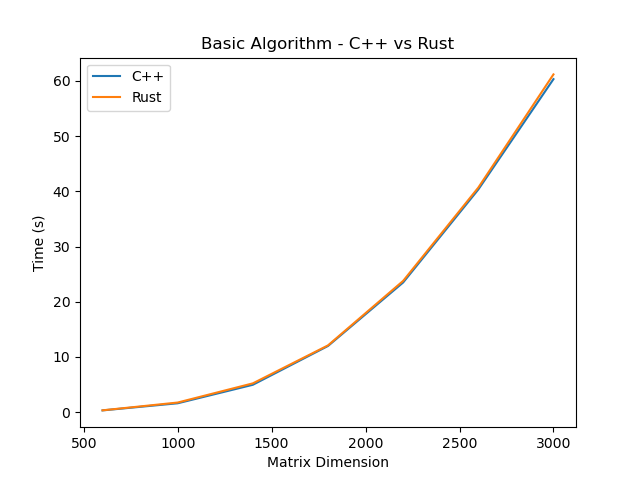</td>
    <td>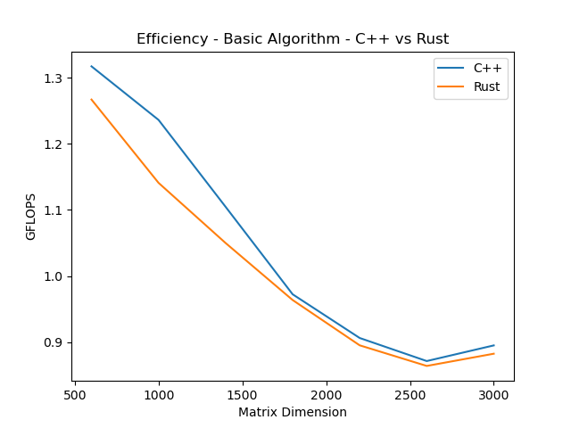</td>
  </tr>
  <tr align="center">
    <td>Figure 1</td>
    <td>Figure 2</td>
  </tr>
</table>

By looking at this graph, it is evident that the difference between the runtime of each language is almost non-existant. Both of them produced very similar results for all matrix sizes, which leads us to conclude that performance wise, for this algorithm, they behaved very alike.

Looking at the efficiency graph, we can see that the efficiency of the algorithm decreases as the matrix size increases. This is to be expected, as the number of operations increases with the matrix size and efficiency is calculated as the number of operations per second.

Regarding the difference between Rust and C++, we can see that C++ is slightly more efficient than Rust for all matrix sizes, but the difference is not significant.

### Line Multiplication

Moving on, we will now evaluate the performance of a different algorithm using these exact same languages - the `OnLineMult`. As mentioned previously, what makes this multiplication differ from the basic one is the switch of the order of the second and third `for` loops.

<table>
  <tr>
    <td>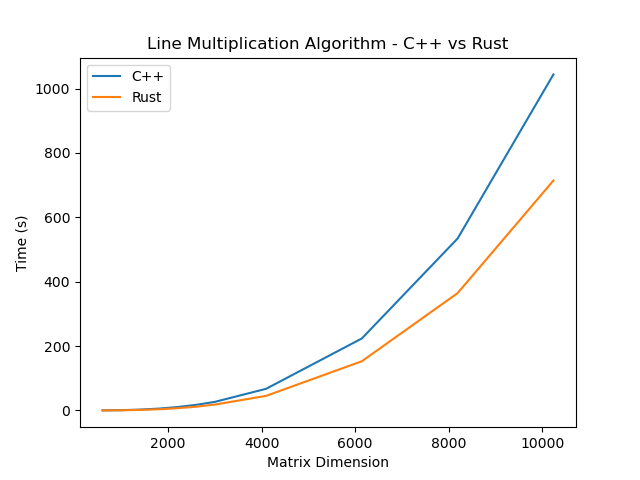</td>
    <td>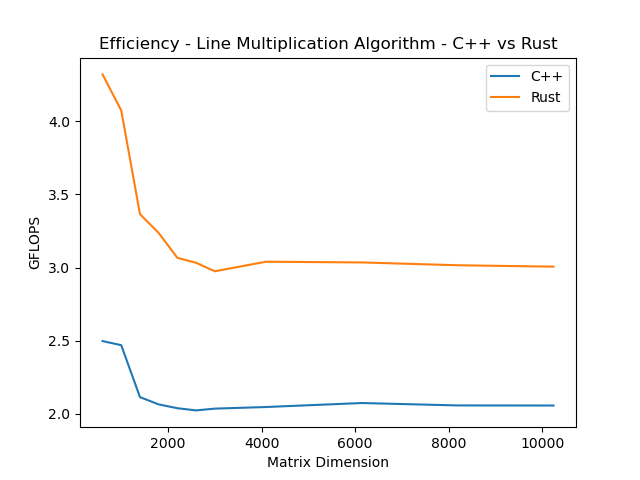</td>
  </tr>
  <tr align="center">
    <td>Figure 3</td>
    <td>Figure 4</td>
  </tr>
</table>

Here we can clearly see very different results; it is possible to notice that both languages presented a better performace, by taking less time to execute.
The difference between the time taken for the two languages is negligible for matrices of smaller size (up to 3000x3000), starting to become more noticeable as the matrix size increases, with Rust having a clear advantage.

When comparing the efficiency of the two versions, we can clearly verify that Rust is more efficient than C++ for all matrix sizes; the sizeable leap in terms of GFLOPS from the simple algorithm is also noticeable.

### Block Multiplication

Lastly we move onto the third and final algorithm. The problem presented required the implementation of an algorithm capable of performing a block oriented multiplication `OnMultBlock`. Its performance was measured using three different block sizes (128, 256 and 512) and larger matrices only.

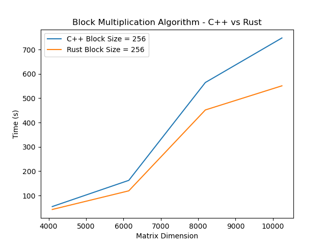

Starting with the difference in runtime between the two languages, we can see that Rust once again presents a better performance than C++ for all block sizes (since the difference between language versions is not mandatory for this algorithm, we will only present the results for the 256 block size, but the same behaviour is observed for other block sizes).

<table>
  <tr>
    <td>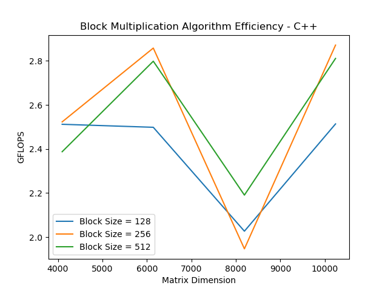</td>
    <td></td>
  </tr>
  <tr align="center">
    <td>Figure 6</td>
    <td>Figure 7</td>
  </tr>
</table>

Analysing the different block sizes in C++, we can notice that, with the block size of 512, the time taken to run the algorithm is slightly lower.

When analysing the efficiency of the different block sizes, we get to the same conclusion as when analysing the runtime: the block size of 512 is the most efficient, despite the difference being negligible.

### Cache Performance Between Algorithms

From this section onwards, we will only be analysing the C++ version of the algorithms, as the Rust version does not provide the necessary metrics to perform the required analysis.

<table>
  <tr>
    <td>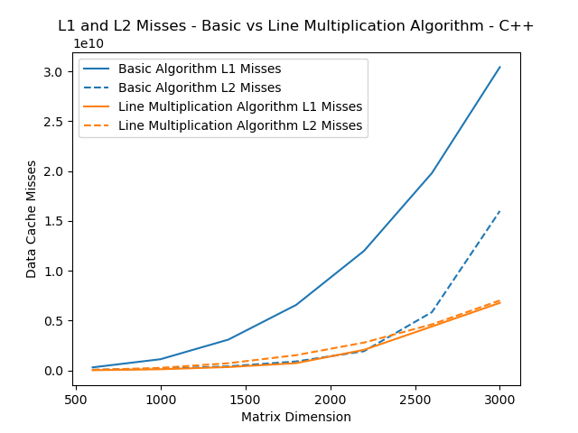</td>
    <td>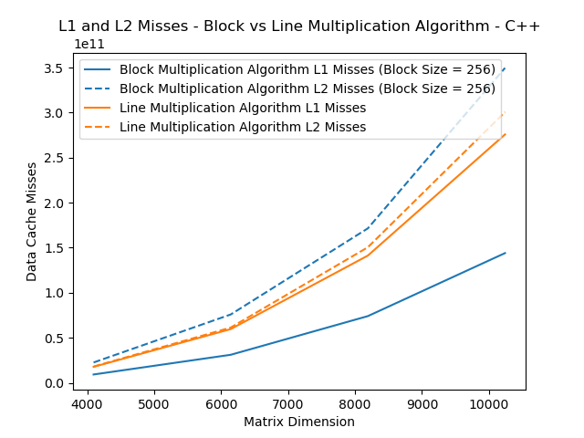</td>
  </tr>
  <tr align="center">
    <td>Figure 8</td>
    <td>Figure 9</td>
  </tr>
</table>

We can see a clear difference between cache misses in the basic and line multiplication algorithms. The line multiplication algorithm has a much lower number of cache misses than the basic algorithm - making it more memory efficient.
This most likely stems from the fact that the line multiplication algorithm not only accesses the matrix one line at a time, but also directly utilizes the result matrix itself as an accumulator (rather than a temporary variable).

When comparing the line and block multiplication algorithms, we can see that the block multiplication algorithm has a lower number of L1 cache misses, with the trade-off of having a higher number of L2 cache misses.

### Multi-core Implementation

We implemented multi-core versions of the basic and line multiplication algorithms, utilizing the same approach regarding parallelization for both.

The first approach (`P1`) was to parallelize the outer loop. The `#pragma omp parallel for private(i, j, k)` statement instructs the compiler to create a parallel region (region where code can be executed on multiple threads concurrently) in the following `for` loop, with `i`, `j` and `k` are private for each thread (helps avoid race conditions when there is concurrent access to these).

```cpp
#pragma omp parallel for private(i, j, k)
for(i=0; i<m_ar; i++) {
    for( j=0; j<m_br; j++) {
        temp = 0;
        for( k=0; k<m_ar; k++) {
            temp += pha[i*m_ar+k] * phb[k*m_br+j];
        }
        phc[i*m_ar+j]=temp;
	}
}
```

The second approach (`P2`) was to parallelize the inner loop. Similarly to the previous approach, the `#pragma omp parallel private(i, j)` statement tells the compiler to create a parallel region where `i` and `j` are private for each thread; however, this time the loop to be parallelized is the innermost `for` loop.

```cpp
#pragma omp parallel private(i, j)
for(i=0; i<m_ar; i++) {
    for( j=0; j<m_br; j++) {
        temp = 0;
        #pragma omp for
        for( k=0; k<m_ar; k++) {
            temp += pha[i*m_ar+k] * phb[k*m_br+j];
        }
        phc[i*m_ar+j]=temp;
    }
}
```

<table>
  <tr>
    <td>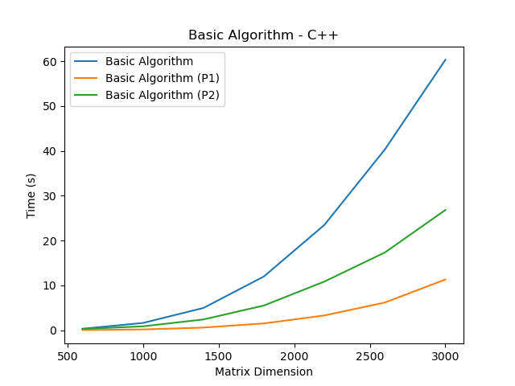</td>
    <td>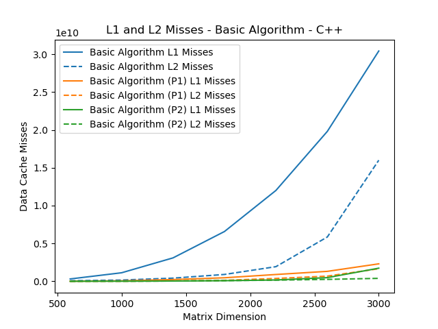</td>
    <td>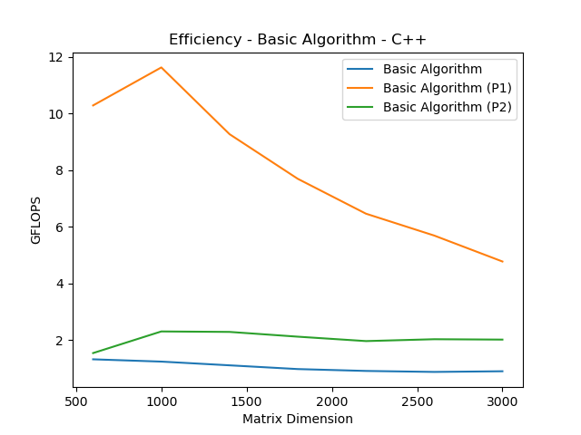</td>
  </tr>
  <tr align="center">
    <td>Figure 10</td>
    <td>Figure 11</td>
    <td>Figure 12</td>
  </tr>
</table>

When comparing the two parallelization approaches for the basic algorithm, we can see that parallelization has a positive impact on runtime, with the first approach having a lower runtime than the second one.

When comparing the number of cache misses of the two parallelization approaches, we can verify that the first approach has a higher number of L1 and L2 cache misses than the second one.

When comparing the efficiency of the two parallelization approaches, we can notice that the first approach is more efficient than the second approach, despite a trend of decreasing efficiency as the matrix size increases.

<table>
  <tr>
    <td>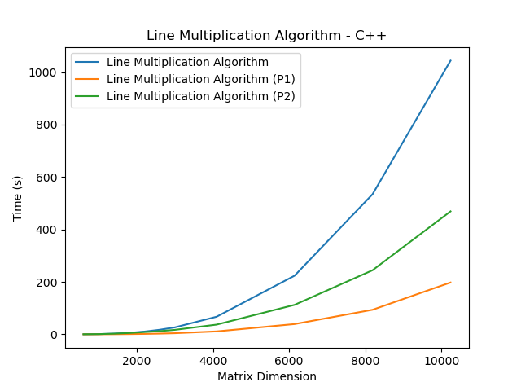</td>
    <td>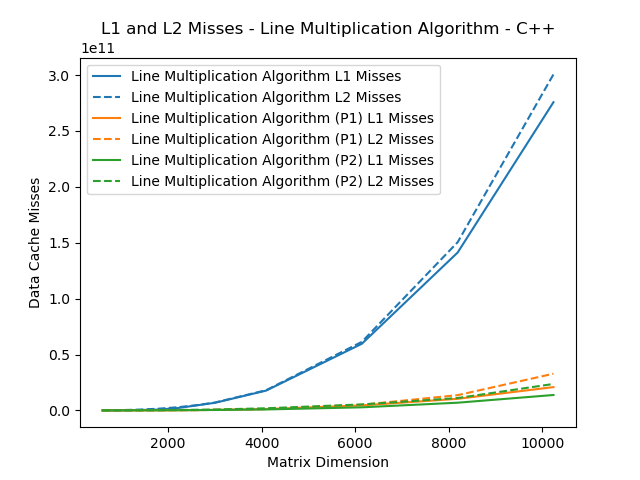</td>
    <td>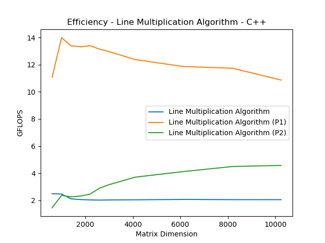</td>
  </tr>
  <tr align="center">
    <td>Figure 13</td>
    <td>Figure 14</td>
    <td>Figure 15</td>
  </tr>
</table>

When comparing the two parallelization approaches for the line algorithm, the positive impact parallelization had on runtime was noticeable, with the first approach having a lower runtime than the second approach.

When comparing the number of cache misses of the two parallelization approaches, we can verify that the first approach has a higher number of L1 and L2 cache misses than the second approach.

When comparing the efficiency of the two parallelization approaches, we can see that the first approach is more efficient than the second approach, despite a trend of decreasing efficiency as the matrix size increases.

Overall, the positive impact of parallelization is noticeable on runtime, cache misses and efficiency, with the first approach being more efficient than the second approach in all cases evaluated.

## Conclusion

In conclusion, this project emphasises how important parallelization techniques, programming language selection, and algorithmic design are to maximising computational efficiency. It allowed us to deepply understand how important memory management is to improve program efficiency.

Through the performance evaluation of matrix multiplication algorithms, both single-core and multi-core, insights into scalability and efficiency across various programming languages and issue sizes were revealed. Parallelization strategies played a crucial role, shedding light on the workload distribution among CPU cores.

## Annexes

These tables contain the average values of the 3 code executions for each scenario.

### A1. C++ Simple Matrix Multiplication

| Matrix Dimension | Time   | L1 Misses     | L2 Misses     |
|-----------|--------|-------------|-------------|
| 600       | 0.328  | 312613350   | 75449586    |
| 1000      | 1.618  | 1129675766  | 168125294   |
| 1400      | 4.968  | 3096109605  | 419079564   |
| 1800      | 11.995 | 6579900575  | 906951403   |
| 2200      | 23.497 | 12002688938 | 1936243626  |
| 2600      | 40.337 | 19807053716 | 5856619363  |
| 3000      | 60.327 | 30424640468 | 15995363861 |

### A2. Rust Simple Matrix Multiplication

| Matrix Dimension | Time   |
|-----------|---------|
| 600       | 0.341   |
| 1000      | 1.753   |
| 1400      | 5.227   |
| 1800      | 12.103  |
| 2200      | 23.788  |
| 2600      | 40.682  |
| 3000      | 61.185  |

### A3. C++ Line Matrix Multiplication

| Matrix Dimension | Time   | L1 Misses     | L2 Misses     |
|-----------|----------|--------------|--------------|
| 600       | 0.173    | 27172532     | 58055068     |
| 1000      | 0.81     | 125563241    | 266504724    |
| 1400      | 2.596    | 344883151    | 727051775    |
| 1800      | 5.65     | 737279058    | 1538298840   |
| 2200      | 10.448   | 2072769000   | 2801149669   |
| 2600      | 17.373   | 4414861665   | 4624084609   |
| 3000      | 26.529   | 6778590305   | 7021324083   |
| 4096      | 67.157   | 17690630310  | 18033744019  |
| 6144      | 223.682  | 59626602635  | 61327226256  |
| 8192      | 534.435  | 141237668769 | 150480108620 |
| 10240     | 1044.108 | 275714586123 | 300590227244 |


### A4. Rust Line Matrix Multiplication

| Matrix Dimension | Time   |
|-----------|---------|
| 600       | 0.1     |
| 1000      | 0.491   |
| 1400      | 1.631   |
| 1800      | 3.604   |
| 2200      | 6.946   |
| 2600      | 11.592  |
| 3000      | 18.155  |
| 4096      | 45.215  |
| 6144      | 152.85  |
| 8192      | 364.617 |
| 10240     | 714.437 |


### A5. C++ Block Matrix Multiplication 

| Matrix Dimension | Block Dimension | Time   | L1 Misses     | L2 Misses     |
|-----------|-----------------|--------|---------------|---------------|
| 4096      | 128             | 54.712 | 9894262681    | 32152630666   |
| 4096      | 256             | 54.475 | 9224194575    | 22558416249   |
| 4096      | 512             | 57.564 | 8907263120    | 20066869753   |
| 6144      | 128             | 185.663| 33284458348   | 109835296393  |
| 6144      | 256             | 162.302| 31100811771   | 75853975333   |
| 6144      | 512             | 165.759| 30034084774   | 68299304963   |
| 8192      | 128             | 542.485| 79272558223   | 256934376125  |
| 8192      | 256             | 564.775| 74040364729   | 171460757906  |
| 8192      | 512             | 501.901| 71418110011   | 159491022894  |
| 10240     | 128             | 854.309| 154538291811  | 509320147291  |
| 10240     | 256             | 747.869| 143989688443  | 349604770144  |
| 10240     | 512             | 763.977| 138999749010  | 314584673439  |

### A6. Rust Block Matrix Multiplication 

| Matrix Dimension | Block Dimension | Time    |
|-----------|-----------------|---------|
| 4096      | 128             | 44.483  |
| 4096      | 256             | 42.524  |
| 4096      | 512             | 43.24   |
| 6144      | 128             | 147.158 |
| 6144      | 256             | 119.213 |
| 6144      | 512             | 118.859 |
| 8192      | 128             | 462.312 |
| 8192      | 256             | 451.872 |
| 8192      | 512             | 387.501 |
| 10240     | 128             | 683.972 |
| 10240     | 256             | 551.07  |
| 10240     | 512             | 541.482 |

### A7. C++ Multi-Core Simple Matrix Multiplication (First Approach)

| Matrix Dimension | Time   | L1 Misses     | L2 Misses     |
|-----------|--------|------------|------------|
| 600       | 0.042  | 18565397   | 2878890    |
| 1000      | 0.172  | 63682673   | 8503272    |
| 1400      | 0.592  | 232236836  | 47556510   |
| 1800      | 1.516  | 467909765  | 129759526  |
| 2200      | 3.296  | 900577438  | 377804411  |
| 2600      | 6.179  | 1316467113 | 686871564  |
| 3000      | 11.315 | 2309707038 | 1660357582 |

### A8. C++ Multi-Core Simple Matrix Multiplication (Second Approach)

| Matrix Dimension | Time   | L1 Misses     | L2 Misses     |
|-----------|--------|------------|------------|
| 600       | 0.281  | 5397565    | 5447147    |
| 1000      | 0.869  | 14712879   | 18907646   |
| 1400      | 2.402  | 37570068   | 45488900   |
| 1800      | 5.51   | 83895824   | 89439677   |
| 2200      | 10.86  | 177572102  | 154929712  |
| 2600      | 17.344 | 486763076  | 256408044  |
| 3000      | 26.821 | 1736195515 | 391698117  |

### A9. C++ Multi-Core Line Matrix Multiplication (First Approach)

| Matrix Dimension | Time   | L1 Misses     | L2 Misses     |
|-----------|---------|-------------|--------------|
| 600       | 0.039   | 2301044     | 3981257      |
| 1000      | 0.143   | 8073936     | 16831198     |
| 1400      | 0.41    | 28940991    | 34331480     |
| 1800      | 0.876   | 104463956   | 96928173     |
| 2200      | 1.59    | 172010582   | 132857297    |
| 2600      | 2.675   | 284661115   | 219721942    |
| 3000      | 4.167   | 488789481   | 455536114    |
| 4096      | 11.106  | 1245436513  | 1119171569   |
| 6144      | 39.121  | 4472383079  | 5045961303   |
| 8192      | 93.669  | 10383502952 | 13628973161  |
| 10240     | 197.672 | 20835676128 | 32814791583  |

### A10. C++ Multi-Core Line Matrix Multiplication (Second Approach)

| Matrix Dimension | Time   | L1 Misses     | L2 Misses     |
|-----------|---------|-------------|--------------|
| 600       | 0.296   | 5378506     | 15284245     |
| 1000      | 0.843   | 19594150    | 59886214     |
| 1400      | 2.426   | 47429145    | 139149072    |
| 1800      | 5.022   | 85069775    | 231916581    |
| 2200      | 8.637   | 158775580   | 402195584    |
| 2600      | 12.085  | 250747939   | 563188863    |
| 3000      | 17.086  | 370592261   | 791711347    |
| 4096      | 37.01   | 852576131   | 1899053309   |
| 6144      | 112.394 | 2757710033  | 5354368189   |
| 8192      | 244.482 | 6891308518  | 11065735945  |
| 10240     | 469.031 | 13779784066 | 23658407930  |
